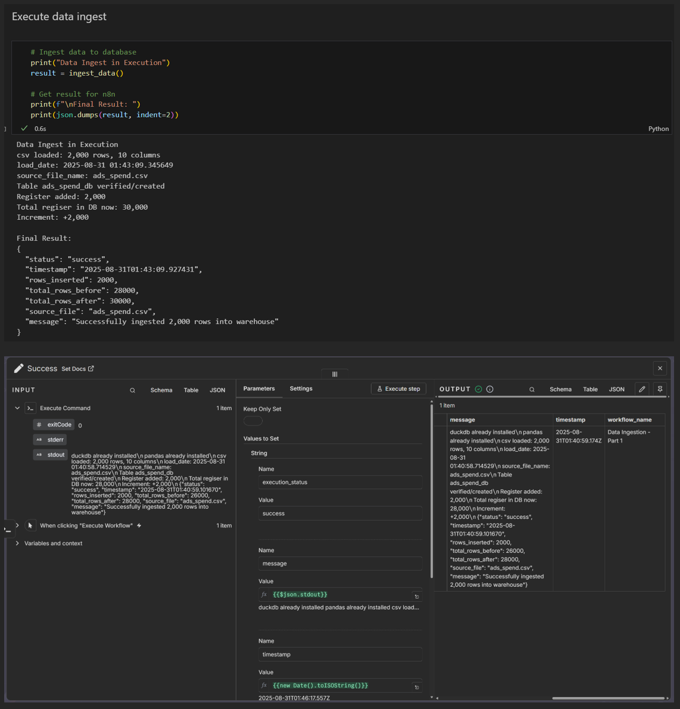
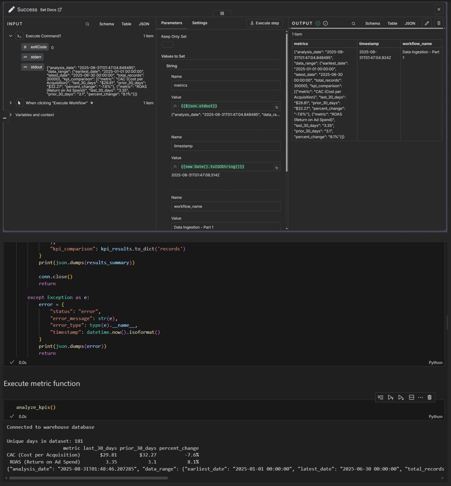
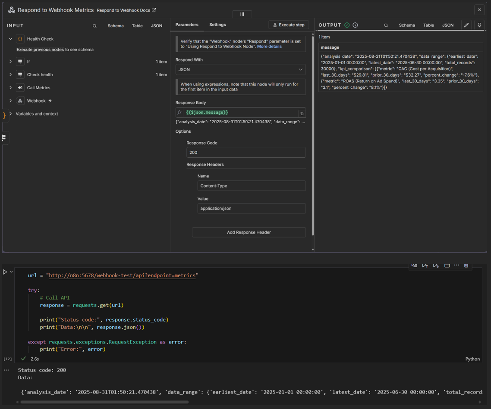
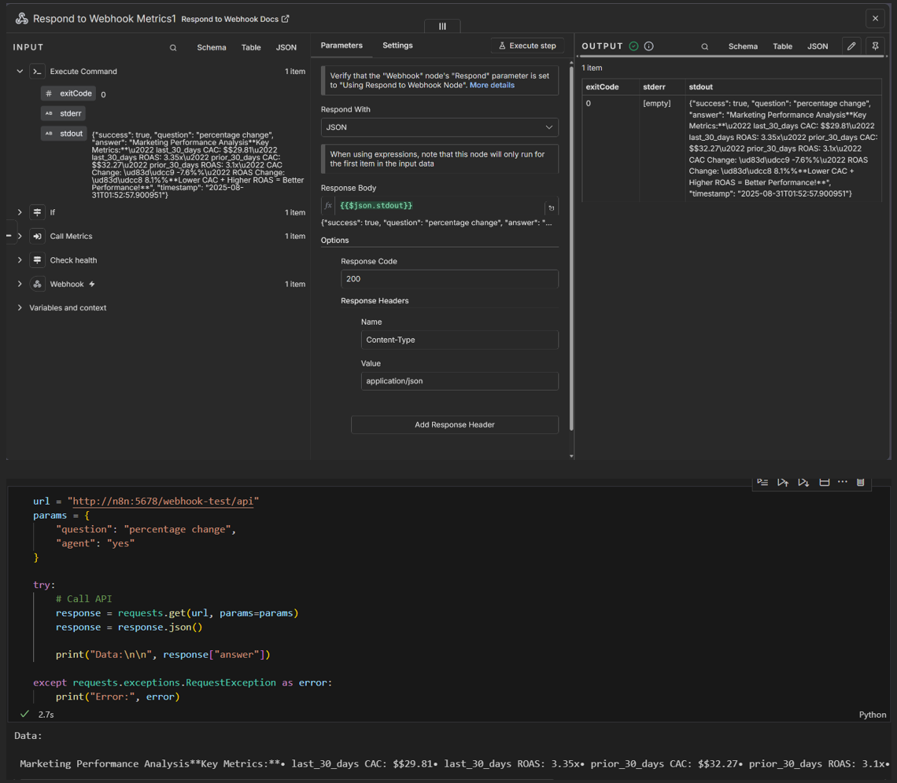

# Challenge-shadowlightstudio
Dev test for AI + Data Engineer role - Carlos Federico Peña Peña

# Project Setup and Execution Guide
## Getting Started
### Prerequisites

- Docker installed on your system

### Installation Steps

1. Clone the repository to your designated local project folder
2. Run Docker Compose - Execute the following command inside your project folder:
    > bashdocker-compose up -d
    - This will mount the images for:

    - naskio/n8n-python
    - jupyter/scipy-notebook

    These images were chosen for their Python compatibility and the packages used in this project. Additionally, in n8n, the OS already has pip and Python installed, making it easier to execute the implemented code.

## Workflow Setup
With the n8n service running, load the workflows that are inside the project's workflows folder (they are in JSON format).
## Project Development
The project is developed in Python, using Jupyter Notebooks for execution. It's recommended to follow the steps in the main.ipynb notebook to understand how it works and implement the database.
## Data Ingestion
For data ingestion, executed in n8n and jupyter, you should see the following:

## Metrics Query
For metrics queries, executed in n8n and jupyter, you should see the following:

## API Metrics Query
For metrics queries through the API, executed in n8n and jupyter, you should see the following:

## Natural Lenguage Agent API Metrics Query
For metrics queries through the API and natural language agent, executed in n8n and jupyter, you should see the following:

## Project Structure
